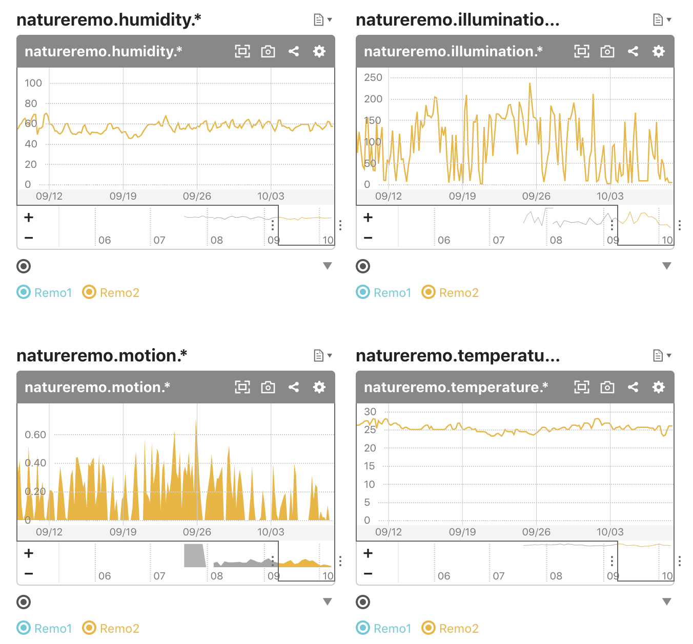

function-natureremo-mackerel
===

Posting sensor values from [Nature Remo](https://nature.global/) to [Mackerel](https://mackerel.io/).

## Settings

### Get API Token
- Nature Remo Cloud API
  - doc https://developer.nature.global/
  - https://home.nature.global/
- Mackerel
  - doc https://mackerel.io/ja/api-docs/
  - https://mackerel.io/my?tab=apikeys

### Write `envs.yaml`

- `NATUREREMO_ACCESS_TOKEN`: Nature Remo Cloud API Access Token
- `MACKEREL_API_KEY`: Mackerel API Key (requires write permission)
- `SERVICE_NAME`: Mackerel Service Name
- `METRIC_PREFIX` (default: `natureremo`)
- `USE_SENSOR_EVENT_TIME` (default: `false`)

## Deploy

### Create a topic

`$ gcloud pubsub topics create remo-to-mackerel`

### Create a scheduler

`$ gcloud scheduler jobs create pubsub kick-remo-to-mackerel --topic=remo-to-mackerel --schedule="every 5 mins" --message-body="{}"`

### Deploy a function subscribing the topic

`$ gcloud functions deploy RemoToMackerel --runtime go113 --trigger-topic=remo-to-mackerel --env-vars-file envs.yaml`

(* To access external network requires [Billing Account](https://cloud.google.com/functions/pricing?hl=ja]) configuration in your project.)
